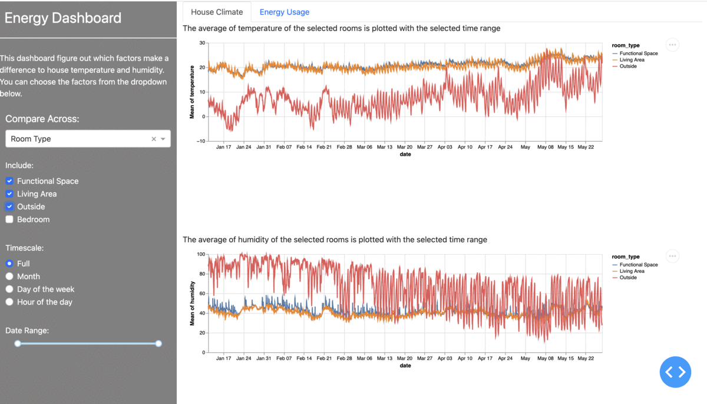
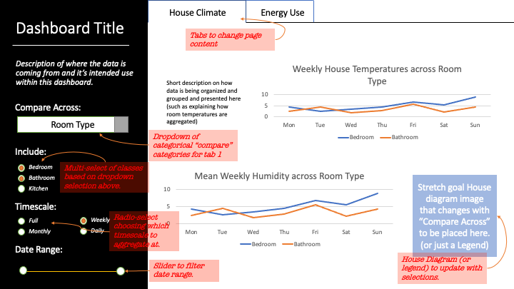
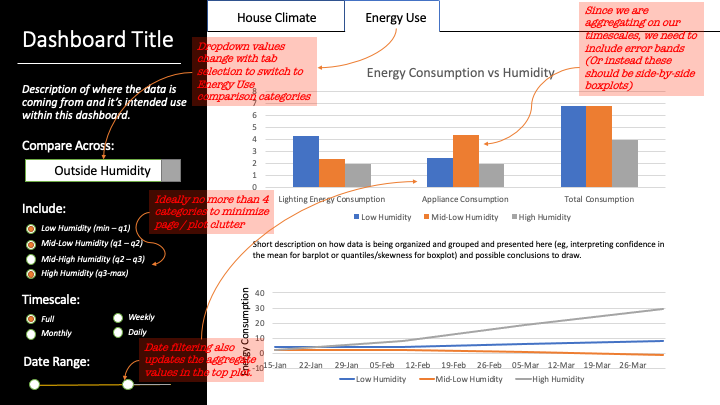

# WELCOME
#  [Energy Usage Dashboard](https://dashboard1-group-a-python.herokuapp.com) (Group A)

Finding the patterns in the energy usage of a house based on weather conditions! Who would think something like weather condition would effect the consumption of energy? We did!!

 
See how the changes are so drastic? Who would have thought?

### Feel free to scroll down or jump straight to one of the below

- [Dashboard deployed on heroku](#access-our-dashboard-here-(Heroku))
- [Contributors](#who-are-the-cool-people-involved)
- [What held our interest](#What-held-our-interest-in-doing-this-project)
- [Working of the dashboard](#How-does-our-dashboard-work)
- [Dataset description](#Description-of-our-dataset)
- [Acknowledgements](#Acknowledgements-and-references)
 

## Access our dashboard here (Heroku)

Gavin: https://dashboard1-group-a-python.herokuapp.com.

Yilin: https://morning-savannah-90323.herokuapp.com.

Disha: https://disha551.herokuapp.com/

Kristy: https://kristydata551.herokuapp.com/

The dashboard created based on a dataset of appliances energy use data in a low energy building. The dashboard will allow users to explore different aspects of the data, like how external factors like temperature, humidity and windspeed trend alongside energy consumption. Other factors such as time of day (morning, afternoon, evening) and day of week (weekday,weekend) and sunlight(east/west) can also be explored by users.  We would like to figure out the house climate and energy use in different time period and if there is a relation between the energy consumptions and the factors. 

## Who are the cool people involved?

- Disha DH loves cooking, solo travelling and bagpacking.
- Gavin Grochowski is busy trying to pull the perfect espresso shot.
- Kristy Phipps loves to dance, cuddle puppies and to learn cool new stuff!
- Yilin Sun likes reading and coding but hate leetcode. 

## What held our interest in doing this project?

Designers, engineers, companies, and individuals everywhere are looking for ways to reduce their carbon footprint. A crucial first step in understanding how to reduce to reduce energy waste is understanding common energy usage patterns.  Therefore, we propose creating a dashboard that will facilitate exploring energy usage patterns in a typical 3-bedroom home. 

We are interested in which factors make a difference to house temperature and which climate factors make an impact on energy usage. We want to figure out whether the energy consumption is effected by the factors such as temperature and humidity. We are interested in if the consumption of energy has big variance in different hours in a day. In addition, we are curious about some relevant topics such as if the type of room make a meaningful difference to room temperature and humidity and the windspeed make an impact on energy usage. 

This dashboard is primarily designed for engineers interested in creating energy efficient homes. However, this dashboard could also be useful as an educational tool for savvy individuals looking to find ways to reduce energy consumption in their homes. 

## How does our dashboard work?

Our dashboard contains two separate tabs for seeing the house climate conditions and the energy usage. The first tab has three components that a user can control. The first component is used for selecting what has to be compared across. On selecting the comparison type, the user can select the sub categories within the comparison type. For example, if the user wants to compare across different room types, the user can choose room type in the first dropdown and can choose the types of rooms using the checkbox. The third component lets the user select the time scale which is full(over 5 months every day), monthly(For 5 months), days of a week and hours of the day. On selecting one of this time scale, the average humidity over the time range selected is displayed over the comparison type.  

The second tab is about energy use. It also has the comparison factor dropdown box.  The second checkbox is used to choose the level of humidity. The third and the fiurth component is used to choose the timescale and date range. The resulting plot will show the energy consumed by lights and appliances in the house for varying levels of conditions specified and the time range specified. It also shows the total energy consumption separately and its relationship with the factor. Below we will include a plot which shows how the selected factor changes over time within the specified range.

These are the initial sketches of our dashboard. This is what we are working towards, but recognize there will likely be some changes along the way. Stay tuned!  

## Description of our dataset

* The data set was donated in the year 2017 by Luis Candanedo, University of Mons (UMONS). The data was collected to create regression models of appliances energy use in a low energy building.
* Each appliance in the house were attached with a sensor node and the temperature and the humidity was recorded every 3.3 minutes. The average of these temperature was recorded for every 10 minutes.
* The data was collected in the year 2016, January 11th to May 27th.
* The outside temperatures were also recorded to check the appliances energy use in low energy buildings.
* The data was divided into training and testing set to perform regression models to reduce the MSE of the model to predict the energy use by an appliance.

## Acknowledgements and references 

Dataset link: http://archive.ics.uci.edu/ml/datasets/Appliances+energy+prediction
